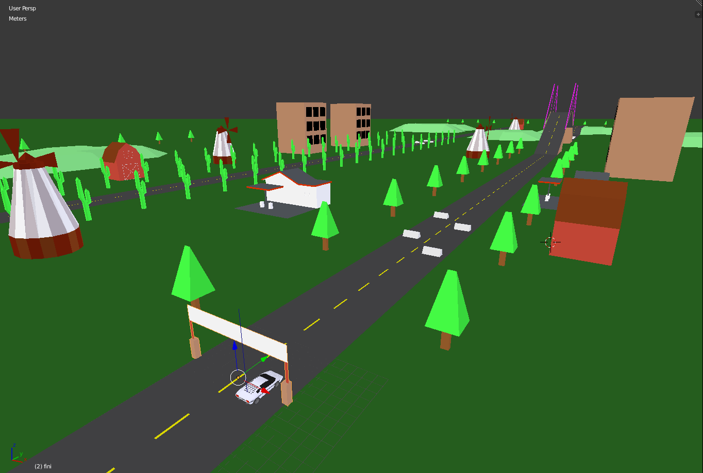

# Stunts remake prototype

## Introduction

This is my attempt to remake one of my favourite DOS games "Stunts", released in 1990. Project is in very early stage of development. So far I've accomplished my first milestone which was to built a simple game engine that would handle graphics, physics and user input. My ultimate goal would be to re-implement core features from the original game and extend them with multiplayer support, but I don't know if there will be enough of cold, rainy Saturdays to accomplish that, lol. Anyway, here is a video that presents what I've implemented so far:

## Game engine
The design of the game engine was inspired by Unity and UE4. I used object oriented design and tried to keep things as simple as possible. The base class for all the entities in the game is called Actor. Actor has two additional components: a static mesh which represents him in the rendering world and a rigid body that carries his physical properties and is used by the physics engine. Actors can be spawned by simply initializing them and adding to a scene which for now is just a vector.

	Actor* terrain = new Actor("assets/models/terrain.obj", physics->dynamicsWorld);
	scene.push_back(terrain);
    
Currently there are following actors in the game:
* terrain
* road
* vehicle
* vehicle wheels

You may wonder why I decided to make road and terrain separate. That's because road has to have a lower friction setting than a terrain. So driving on a terrain will result in a speed decrease as you would expect in any racing game. Another approach to achieve this effect would be to raycast downward from the vehicle or from each wheel separately (btRaycastVehicle class provides that functionality) and detect material type of raycast's contact point. I might switch to that approach later on, but for now setting different friction values works ok. 

After the actors are added, the main game loop starts and consists of the following actions:
* Handle user input
* Step physics by delta time ( time required to compute last frame )
* Update actor's transforms ( location, rotation ) based on physics engine
* Update camera position
* Render scene

The above mentioned logic resides in:

    main.cpp
   

#### Rendering
Rendering engine supports 3d models in .obj format with .mtl materials. This means that tracks and vehicles can be built using any 3d modelling software that exports to the above mentioned formats. I created a track in the video using Blender. Some of the assets you can see on the map like windmill, barn, ramp and trees were extracted from the original game. I'm not uploading them to this repository since I don't want to violate any copyright laws, but the format and extraction method of assets from the original game is well known and documented on the internet. The final version of my project would require to have the original game installed.

Currently the rendering pipeline does not support textures, only solid colors, which are rendered using flat shading. 

There is a lot of room for an optimialization, one of the first things that come to mind would be to implement material batching. Right now one draw call is issued per model, per material which is not very effective to say at least. Still, with the current amount of materials and so simple geometry, rendering one frame usually does not exceed 1ms even on an average gpu. 

#### Physics
I integrated Bullet Physics library as a physics engine. For static objects, I'm using rigidbodies with btBvhTriangleMeshShape and per vertex collisions. Vehicle is based on a btRaycastVehicle class that comes with Bullet and gave me a lot of unexpected problems while working with it. Most notably - the vehicle was jumping on an edge loop of a triangle like if it were an obstacle, even though the surface was totaly flat. After going through a tons of documentation, source code and forums I've found out that one remedy for that is was to disable rigid body's contact processing treshold like so:
    
    rigidBody->setContactProcessingThreshold(0.f);

Another challenge was to setup all the vehicle parameters correctly, you can see my attempts of that on the video above. This was the first time I was working with car physics and definitely a good lesson. In the end I think I'm going to implement my own vehicle class or a simple physics engine since I'm not sure if I will be able configure Bullet so that it mimicks the physics engine of the original game closely enough. Currently vehicle settings are stored in .txt file, so they can be modified without touching the source code. 

## Compilation
#### Windows
* Open the solution file with Visual Studio: 

        projects/vs2017/stunts_remake.sln

* Choose 'Release x86' configuration and build solution

Please note that all the dependencies are precompiled and linked as a windows static libraries so you don't have to download or compile any additional stuff. 

#### Mac, Linux
* TODO

## Links

* Bullet Physics ( http://www.bulletphysics.org )
* GLFW ( https://www.glfw.org/ )
* GLM ( https://glm.g-truc.net/0.9.9/index.html )
* Tiny Object Loader ( https://github.com/syoyo/tinyobjloader )
* Lamborghini Bravo model made by BDFSPACE69 ( https://www.blendswap.com/blends/view/73626 )

